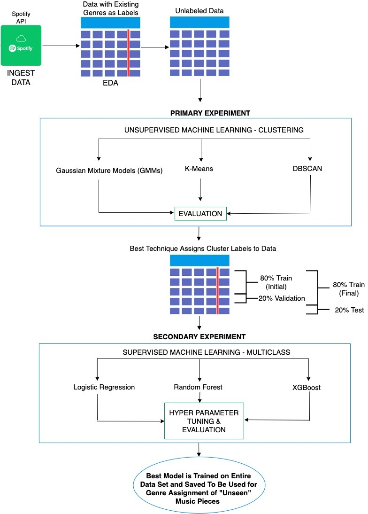

# Model-Based Approach to Music Genre Assignment

Musical genre classification is not an easy task. In this project, unsupervised and supervised machine learning techniques are utilizied to classify popular songs from Spotify based on audio features. This approach aims to replace human judgement with algorithmic decision-making to better assign genres to songs using musical features. 

[YouTube: Model Based Approach to Genre Assignment](https://www.youtube.com/watch?v=6-7XFk4KC9M)

## Flow Chart




## Guide

In the `10_clustering` directory you'll find `gaussian_mixture_clusters.ipynb` and `kmeans_cluster.ipynb`, which are notebooks for the Unsupervised Machine Learning models. All of the accessory files for those notebooks are located in the same directory. `20_classification` contains the notebook `classification_code.ipynb` for the Supervised Learning methods implemented. In the `30_docs` you'll find both presentation slides on findings and a full report.

## Getting started

Open your terminal and run the following lines in order: 

1. `git clone git@github.com:rmratliffbrown/ml-genre-assignment.git`

2. `cd ml-genre-assignment`

3. `pip install -r requirements.txt`

From here you'll be able to run any of notebooks in the repository without any trouble. 

## Data

The data was originally sourced utilizing Spotify's API, but can be easily accessed here: 
```
https://github.com/rfordatascience/tidytuesday/blob/master/data/2020/2020-01-21/spotify_songs.csv
```
### Data Dictionary
|variable                 |class     |description |
|:---|:---|:-----------|
|track_id                 |string | Song unique ID|
|track_name               |string | Song Name|
|track_artist             |string | Song Artist|
|track_popularity         |float    | Song Popularity (0-100) where higher is better |
|track_album_id           |string | Album unique ID|
|track_album_name         |string | Song album name |
|track_album_release_date |string | Date when album released |
|playlist_name            |string | Name of playlist |
|playlist_id              |string | Playlist ID|
|playlist_genre           |string | Playlist genre |
|playlist_subgenre        |string | Playlist subgenre|
|danceability             |float    | Danceability describes how suitable a track is for dancing based on a combination of musical elements including tempo, rhythm stability, beat strength, and overall regularity. A value of 0.0 is least danceable and 1.0 is most danceable. |
|energy                   |float    | Energy is a measure from 0.0 to 1.0 and represents a perceptual measure of intensity and activity. Typically, energetic tracks feel fast, loud, and noisy. For example, death metal has high energy, while a Bach prelude scores low on the scale. Perceptual features contributing to this attribute include dynamic range, perceived loudness, timbre, onset rate, and general entropy. |
|key                      |float    | The estimated overall key of the track. Integers map to pitches using standard Pitch Class notation . E.g. 0 = C, 1 = C♯/D♭, 2 = D, and so on. If no key was detected, the value is -1. |
|loudness                 |float    | The overall loudness of a track in decibels (dB). Loudness values are averaged across the entire track and are useful for comparing relative loudness of tracks. Loudness is the quality of a sound that is the primary psychological correlate of physical strength (amplitude). Values typical range between -60 and 0 db.|
|mode                     |float    | Mode indicates the modality (major or minor) of a track, the type of scale from which its melodic content is derived. Major is represented by 1 and minor is 0.|
|speechiness              |float    | Speechiness detects the presence of spoken words in a track. The more exclusively speech-like the recording (e.g. talk show, audio book, poetry), the closer to 1.0 the attribute value. Values above 0.66 describe tracks that are probably made entirely of spoken words. Values between 0.33 and 0.66 describe tracks that may contain both music and speech, either in sections or layered, including such cases as rap music. Values below 0.33 most likely represent music and other non-speech-like tracks. |
|acousticness             |float    | A confidence measure from 0.0 to 1.0 of whether the track is acoustic. 1.0 represents high confidence the track is acoustic.|
|instrumentalness         |float    | Predicts whether a track contains no vocals. “Ooh” and “aah” sounds are treated as instrumental in this context. Rap or spoken word tracks are clearly “vocal”. The closer the instrumentalness value is to 1.0, the greater likelihood the track contains no vocal content. Values above 0.5 are intended to represent instrumental tracks, but confidence is higher as the value approaches 1.0. |
|liveness                 |float    | Detects the presence of an audience in the recording. Higher liveness values represent an increased probability that the track was performed live. A value above 0.8 provides strong likelihood that the track is live. |
|valence                  |float    | A measure from 0.0 to 1.0 describing the musical positiveness conveyed by a track. Tracks with high valence sound more positive (e.g. happy, cheerful, euphoric), while tracks with low valence sound more negative (e.g. sad, depressed, angry). |
|tempo                    |float    | The overall estimated tempo of a track in beats per minute (BPM). In musical terminology, tempo is the speed or pace of a given piece and derives directly from the average beat duration. |
|duration_ms              |float    | Duration of song in milliseconds |
